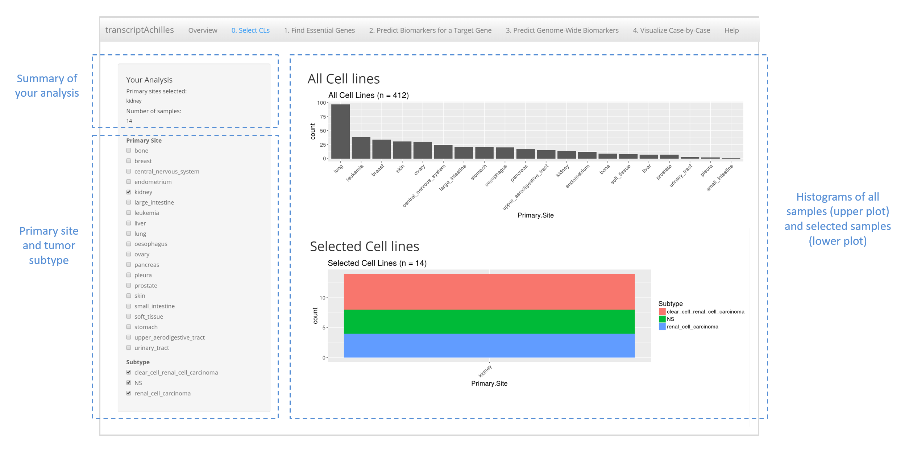
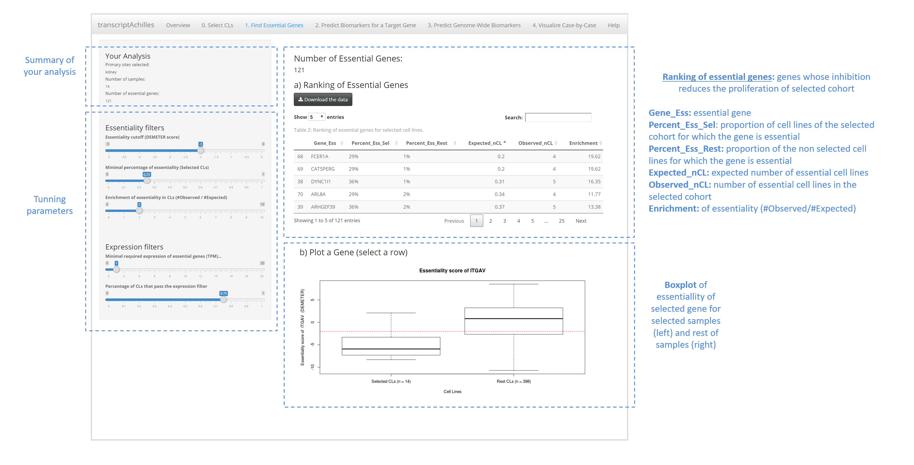
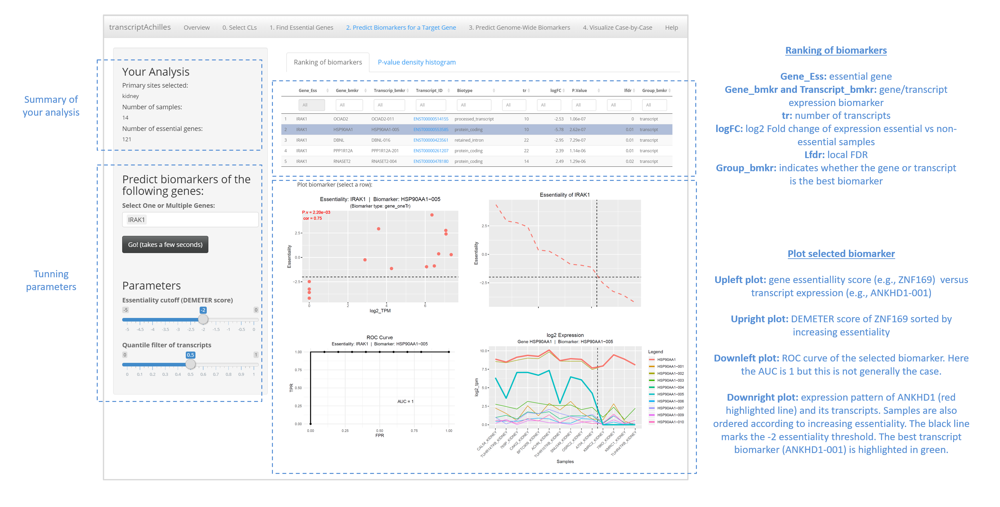

<p style="text-align:center;"></p>

<center>


## Welcome to TranscriptAchilles


We present TranscriptAchilles, the first large-scale tool to predict transcript biomarkers of gene essentiality. 

Gene essentiality is modeled using the essentiality scores of DEMETER. These scores measure the proliferation/viability of a cell line when knocking-down a gene in a competitive experiment. DEMETER’s authors suggests a threshold of -2 in this score to state that a cell line is sensitive to a knock-down. 

TranscriptAchilles integrates **412 loss-of-function RNA interference screens** of over 17,000 genes together with their corresponding **whole-transcriptome** RNA-seq expression profiling of the [Cancer Cell Line Encyclopedia](https://portals.broadinstitute.org/ccle). 
<br>

TranscriptAchilles has been developed to achieve the following analysis:


**1. Find essential target genes for a cohort of cell lines**

**2. Predict putative companions biomarkers for these essential genes** (either transcript or gene expression)

<br>

#### **The data is already loaded in the app and ready for analysis! :)**
<br>

## Running TranscriptAchilles

TranscriptAchilles can be launched either on the public web application of TranscriptAchilles, on a local machine using R and RShiny or within Docker. 


### Web application

link: [TranscriptAchilles](http://biotecnun.unav.es:8080/)

### Local

Clone the repository

```git
git clone https://gitlab.com/fcarazo.m/transcriptachilles.git

```

Install dependencies

```r
# CRAN's packages

install.packages(c('shiny', 'shinyjs', 'shinythemes', 'ggplot2', 'scales', 'dply', 'rMatrix', 'matrixStats', 'tidyr', 'readr', 'psych', 'pheatmap', 'RColorBrewer', 'progress', 'grid', 'shinycssloaders', 'rmarkdown', 'DT', 'ROCR', 'plotROC'), repos='https://cloud.r-project.org/')

# Bioconductor's packages
source('https://bioconductor.org/biocLite.R');biocLite(); biocLite(pkgs=c('impute', 'limma', 'STRINGdb', 'qvalue'))

```

Run RShiny

```r
shiny::runApp('app.R')
```

### Build Docker from scratch

The application can also be run inside Docker to avoid installation problems of R packages and to facilitate scalability.
We highly recommend to build it via Docker Hub (Next Section), but it can be also built from scratch as follows:


Follow these steps to build a Docker image:

1. Install Docker  [link](https://docs.docker.com/install/)
2. Create a folder called "transcriptachilles_app" in your local machine
3. Clone this GitLab repository in the "transcriptachilles_app" folder
4. Move the two Docker files (Rprofile.site and Dockerfile) stored in the "dockerFiles" folder to the "transcriptachilles_app" folder
5. Navigate to the "transcriptachilles_app" folder and run:


```git
sudo docker build -t fcarazo/transcriptachilles .

```
### Build Docker from Docker Hub

The Docker image can be also pulled from Docker Hub [here](https://hub.docker.com/r/fcarazo/transcriptachilles).

### Once the Docker image is built:

#### Run TranscriptAchilles in a Docker App

Run the following command:

```git
sudo docker run -p 3838:3838 fcarazo/transcriptachilles R -e 'shiny::runApp("/root/transcriptachilles")'

```

Now, you can point your browser to [http://localhost:3838](http://localhost:3838) and use TranscriptAchilles!


#### Run TranscriptAchilles in a web-server through Shinyproxy

 A web server can be started using Shinyproxy.
 
Install and configure ShinyProxy following the instructions [here](https://www.shinyproxy.io/getting-started/).


The server configuration is mainly done in a file named `application.yml`. Add a file named `application.yml` with the [default values](https://github.com/openanalytics/shinyproxy/blob/master/src/main/resources/application-demo.yml) in the same folder where you launch the shinyproxy-*.jar file and add the following lines:


``` git
  - name: TranscriptAchilles
    display-name: TranscriptAchilles
    description: Application to find transcript biomarkers in CCLE samples
    docker-cmd: ["R", "-e", "shiny::runApp('/root/transcriptachilles')"]
    docker-image: fcarazo/transcriptachilles
    groups: [group_name]
```

ShinyProxy can be run using the following command

```git
java -jar shinyproxy-2.1.0.jar 

```

### Download data

The original data (isoform expression) used in the app can be downloaded from the source publication [here](https://osf.io/gqrz9) [1]

The integrated data (isoform expression and DEMETER) can be downloaded from [here](https://gitlab.com/fcarazo.m/transcriptachilles/tree/master/dataShiny) in three versions:

1.  DataForShiny2.RData: all integrated data
2. DataForShiny2_opt.RData: optimized data (low expressed transcripts removed)
3. DataForShiny2_opt_small.RData: a small sample of optimized data

[1] Tatlow PJ, Piccolo SR. A cloud-based workflow to quantify transcript-expression levels in public cancer compendia. Sci Rep 

## Quick start

TranscriptAchilles outputs a ranking of putative drug target genes and their companion biomarkers for a given cohort of cell lines. 

The functionalities of TranscriptAchilles are presented in a set of panels:
<br>


### 1. Select cell lines

The user is required to select the cohort of cell lines to be analyzed. Several primary sites and subtypes can be selected at the same time. The application is pre-loaded with all the necessary data, so that the user does not need to upload any data.



<br>


### 2. Find essential genes

The second step of the analysis consists in extracting a list of genes that are essential for cell viability of the selected cell lines. Five tunable parameters allow the user to tailor the output. The toolbox provides a default value for each parameter. The assigned values correspond to our understanding of the minimum conditions which need to be satisfied by a gene to be essential.

The filters correspond to three criteria: essentiality, specificity and expression. Essentiality is a two-legged characteristic.  It refers to the percentage of selected cell lines that have a DEMETER score lower than the essentiality cut-off. Specificity is represented by the enrichment ratio. This filter allows the user to define the minimum ratio between the proportion of selected cell lines for which a gene is essential and the proportion of the rest of the cell lines for which the same gene is essential. Finally, essential genes are required to be expressed with the expression filters.



<br>


### 3. Predict biomarkers for a target gene

In this section, the user can select one or more genes of the previous step and predict putative biomarkers of essentiality. In each case, the application decides whether genes or transcripts are the best markers (see the main manuscript for further details).



<br>

### 4. Predict Genome-Wide Biomarkers. 

Biomarkers can also be found for **all** the essential genes identified in the step 2. 
<br>

### 5. Visualize Case-by-Case. 

The user can visualize the essentiality of any gene and transcript biomarker.
<br>


## Cite Us

*F. Carazo, L. Campuzano, X. Cendoya, F. J. Planes and A Rubio. "TranscriptAchilles App"*


## Session Info 

```r

 sessionInfo()
R version 3.3.2 (2016-10-31)
Platform: x86_64-w64-mingw32/x64 (64-bit)
Running under: Windows >= 8 x64 (build 9200)

locale:
[1] LC_COLLATE=English_United States.1252  LC_CTYPE=English_United States.1252   
[3] LC_MONETARY=English_United States.1252 LC_NUMERIC=C                          
[5] LC_TIME=English_United States.1252    

attached base packages:
[1] grid      stats     graphics  grDevices utils     datasets  methods   base     

other attached packages:
 [1] qvalue_2.6.0          limma_3.30.13         DT_0.4                rmarkdown_1.1        
 [5] shinycssloaders_0.2.0 impute_1.48.0         progress_1.1.2        RColorBrewer_1.1-2   
 [9] pheatmap_1.0.8        psych_1.8.3.3         readr_1.0.0           tidyr_0.6.0          
[13] matrixStats_0.51.0    Matrix_1.2-7.1        dplyr_0.5.0           scales_0.4.0         
[17] ggplot2_2.1.0         shinythemes_1.1.1     shinyjs_0.7           shiny_1.0.5          
[21] RevoUtilsMath_10.0.0 

loaded via a namespace (and not attached):
 [1] Rcpp_0.12.7       plyr_1.8.4        prettyunits_1.0.2 tools_3.3.2      
 [5] digest_0.6.14     evaluate_0.10     tibble_1.2        gtable_0.2.0     
 [9] nlme_3.1-128      lattice_0.20-34   DBI_0.5-1         yaml_2.1.13      
[13] parallel_3.3.2    stringr_1.1.0     htmlwidgets_1.0   RevoUtils_10.0.2 
[17] R6_2.2.0          foreign_0.8-67    reshape2_1.4.2    magrittr_1.5     
[21] splines_3.3.2     htmltools_0.3.6   assertthat_0.1    mnormt_1.5-5     
[25] mime_0.5          xtable_1.8-2      colorspace_1.2-7  httpuv_1.3.6.2   
[29] stringi_1.1.2     miniUI_0.1.1      munsell_0.4.3    
```