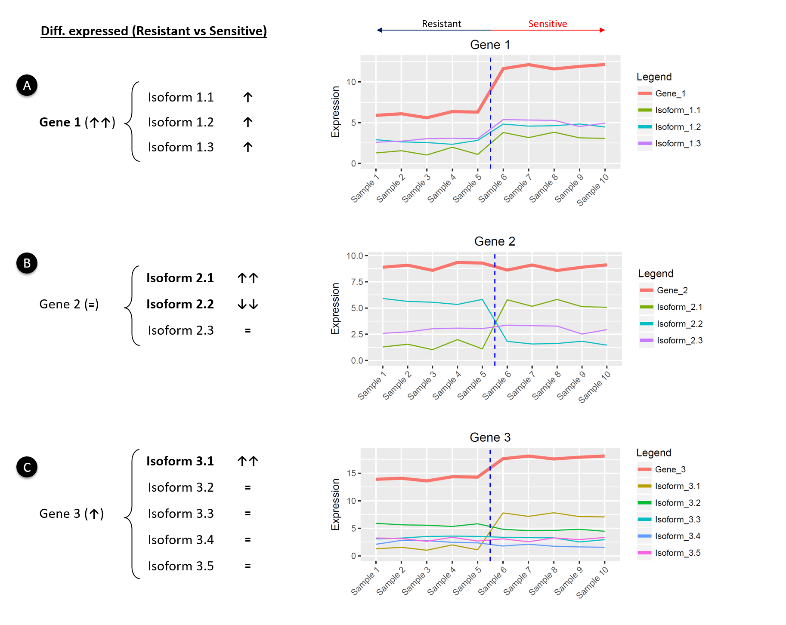
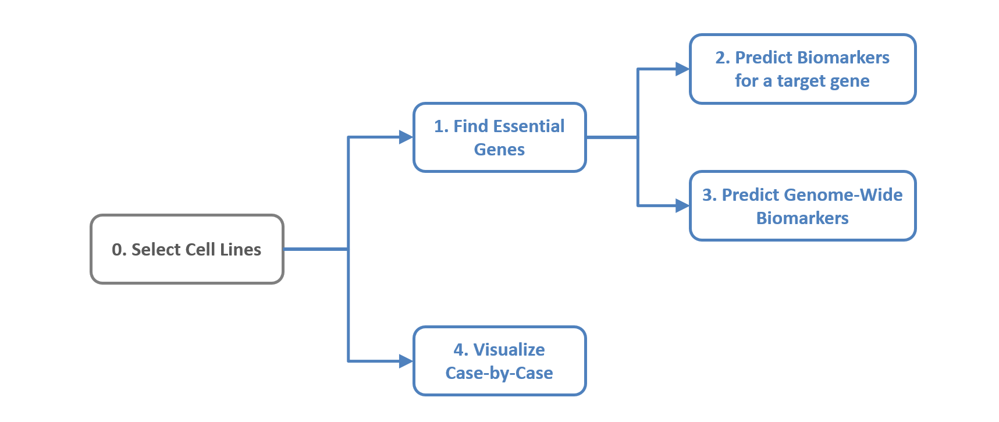

## Welcome to TranscriptAchilles!

TranscriptAchilles is a genome-wide interactive tool to predict transcript biomarkers of sensitivity to gene inhibition in cancer cell lines of the Cancer Cell Line Encyclopedia.  

This tool integrates loss-of-function RNA interference screens of over **17,000 genes** together with whole-transcriptome expression profiling (RNA sequencing) of **412 cancer cell lines**.
 

TranscriptAchilles has been developed to achieve the following analysis:

**1. Find essential target genes for a cohort of cell lines**

**2. Predict putative companions biomarkers for these essential genes** (either transcript or gene expression)

 
 
##### **The data is already loaded in the app and ready for analysis! :)**
 
 

## Data integration and workflow

The Cancer Cell Line Encyclopedia (CCLE) provides public access to genomic data of up to **900 cancer cell lines**. The transcriptome profiles of these samples were calculated in a previous study from raw RNA sequencing data using Kallisto employing Gencode 24 transcriptome (GRCh 38) as the reference annotation. This version of the transcriptome contains **199.169 transcripts**. Transcripts were normalized as Transcripts Per Million (TPM) and filtered (quantile 0.5 excluding non-expressed transcripts).

Project Achilles includes RNAi loss-of-function screens of over **17,000 genes** in around 500 cancer cell lines. **412 of these cell lines** match CCLE’s cell line cohort.

**We used the DEMETER score as the essentiality score. The more negative the DEMETER score is, the more essential the gene is for a cell line. Authors of DEMETER stablished a cut-off of -2 as a threshold of essentiality. Genes with DEMETER scores lower than this threshold can be considered essential for a cell line.**

Figure 1 depicts an overview of the workflow. 

 

*Figure 1. Overview of the data integration. More details of the statistical model can be found in the publication.*

 
 

## Justification of transcriptome-level analysis

The following illustrative toy example shows the importance of isoform-level analysis in some cases (see the figure's caption).

#### 
 

*Figure 6. Illustrative toy example showing the importance of the isoform-level. The expression values of three different genes (red) and their corresponding isoforms are shown across 10 hypothetical samples (5 resistant and 5 sensitive to the inhibition of a given gene). The expression value of each gene consists of the sum of the expression values of all its transcripts. Up- and down- arrows represent the direction and intensity of the expression changes between the two conditions. In each case, the gene/isoform with the most significant expression change is highlighted in bold. A) Gene 1 is overexpressed in sensitive samples. In this case all isoforms show a similar behavior. B) Gene 2 does not change between the two conditions. Following a traditional gene-level analysis this gene would be lost. However, there is a clear expression change in Isoforms 2.1 and 2.2, which are up- and down- regulated respectively (isoform switch). C) Gene 3 is overexpressed in sensitive samples, but this change is better conveyed by Isoform 3.1. Both cases B and C have transcripts more differentially expressed than genes.*

 
 

## Quick start

TranscriptAchilles tool outputs a ranking of putative drug target genes and their companion biomarkers for a given cohort of cell lines. The functionalities of TranscriptAchilles are presented in a set of panels in the app. Figure 2 shows the TranscriptAchiles' pipeline. 

*Figure 2. TranscriptAchiles' pipeline*

 

The steps of the pipeline are:

**0. Select cell lines.** The user is required to select the cohort of cell lines to be analyzed. Several primary sites and subtypes can be selected at the same time. The application is pre-loaded with all the necessary data, so that the user does not need to upload any data.

**1. Find Essential Genes.**  TranscriptAchilles identifies putative drug targets for the selected cell lines. Essential genes are required to meet several criteria: 1) they must be essential for a minimum percentage of samples in the selected subtype, 2) they must be specific and 3) they must be expressed. These parameters can be tuned within the application.

**2. Predict Biomarkers for a Target Gene.** In this section, the user can select one or more genes of the previous step and predict putative biomarkers for their essentiality. In each case, the application decides whether genes or transcripts are the best markers.

**3. Predict Genome-Wide Biomarkers.** In this case the biomarkers are found for all the essential genes identified in the step Find Essential Genes. 

**4. Visualize Case-by-Case.** The user can also visualize the essentiality of any gene and transcript biomarker. This panel can be run once the cell lines are selected.

 

#### **Let's start!!**

 
 

