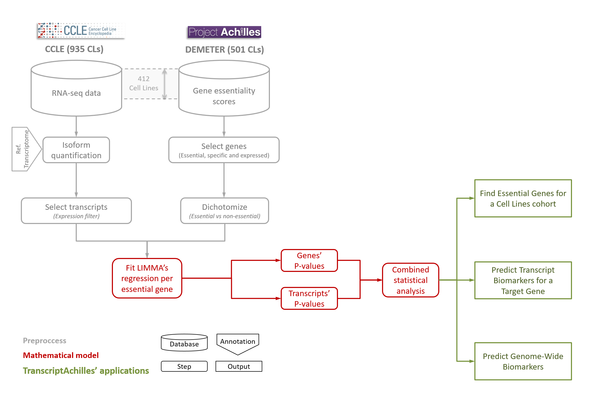

<p style="text-align:center;"></p>

<center>

#### *"A large-scale platform to predict cancer targets and transcript biomarkers"*
</center>


<br>


## Welcome!

#### We present TranscriptAchilles, the first large-scale tool to predict transcript biomarkers associated with gene inhibition sensitivity. 
#### This application integrates **412 loss-of-function RNA interference screens** of over 17,000 genes together with their corresponding **whole-transcriptome** RNA-seq expression profiling of the [Cancer Cell Line Encyclopedia](https://portals.broadinstitute.org/ccle). 
<br>

#### TranscriptAchilles has been developed to achieve the following analysis:

#### **1. Find novel target genes for a cohort of cell lines**

#### **2. Predict putative companions biomarkers for essential genes** (biomarkers can be either transcript or gene expression)

<br>

#### TranscriptAchilles has been developed using the [Docker](https://www.docker.com/) container framework that guarantees computational reproducibility and facilitates collaborative research. 
#### The databases and source code are available at [GitLab](https://gitlab.com/fcarazo.m/transcriptAchilles.git/)


<center>
<br>
#### **The data is already loaded in the app and ready for analysis! :)**
<br>
</center>


## Quick start

#### TranscriptAchilles outputs a ranking of putative drug target genes and their companion biomarkers for a given cohort of cell lines. 

#### The functionalities of TranscriptAchilles are presented in a set of panels:
<br>


### 1. Select cell lines

#### The user is required to select the cohort of cell lines to be analyzed. Several primary sites and subtypes can be selected at the same time. The application is pre-loaded with all the necessary data, so that the user does not need to upload any data.


<br>


### 2. Find essential genes

#### The second step of the analysis consists in extracting a list of genes that are essential for cell viability of the selected cell lines. Five tunable parameters allow the user to tailor the output. The toolbox provides a default value for each parameter. The assigned values correspond to our understanding of the minimum conditions which need to be satisfied by a gene to be essential.

#### The filters correspond to three criteria: essentiality, specificity and expression. Essentiality is a two-legged characteristic.  It refers to the percentage of selected cell lines that have a DEMETER score lower than the essentiality cut-off (see **NOTE**). Specificity is represented by the enrichment ratio. This filter allows the user to define the minimum ratio between the proportion of selected cell lines for which a gene is essential and the proportion of the rest of the cell lines for which the same gene is essential. Finally, essential genes are required to be expressed with the expression filters.


<br>


### 3. Predict biomarkers for a target gene

#### In this section, the user can select one or more genes of the previous step and predict putative biomarkers of essentiality. In each case, the application decides whether genes or transcripts are the best markers (see the main manuscript for further details).


<br>

### 4. Predict Genome-Wide Biomarkers. 

#### Biomarkers can also be found for **all** the essential genes identified in the step 2. 
<br>

### 5. Visualize Case-by-Case. 

#### The user can visualize the essentiality of any gene and transcript biomarker.
<br>


## Running TranscriptAchilles locally

#### TranscriptAchilles can also be run locally. The databases and source code are available at [GitLab](https://gitlab.com/fcarazo.m/transcriptAchilles.git/). 

#### Once the git repository is cloned, TranscriptAchilles’ dependencies can be installed with the following lines of code (also included in the repository):

<br>

```{r eval=F, echo=T}
# CRAN's packages

install.packages(c('shiny', 'shinyjs', 'shinythemes', 'ggplot2', 'scales', 'dply', 'rMatrix', 'matrixStats', 'tidyr', 'readr', 'psych', 'pheatmap', 'RColorBrewer', 'progress', 'grid', 'shinycssloaders', 'rmarkdown', 'DT', 'ROCR', 'plotROC'), repos='https://cloud.r-project.org/')

# Bioconductor's packages
source('https://bioconductor.org/biocLite.R');biocLite(); biocLite(pkgs=c('impute', 'limma', 'STRINGdb', 'qvalue'))

```
<br>

#### Then, the shiny app can be run locally simply by typing:


```{r eval=F, echo=T}

shiny::runApp('./transcriptachilles')

```


<br>

## Data integration and workflow


#### The Cancer Cell Line Encyclopedia (CCLE) provides public access to genomic data of up to **900 cancer cell lines**. 
#### The transcriptome profiles of these samples were calculated in a previous study from raw RNA sequencing data using Kallisto employing Gencode 24 transcriptome (GRCh 38) as the reference annotation. 
#### This version of the transcriptome contains **199.169 transcripts**. 


#### Project Achilles includes RNAi loss-of-function screens of over **17,000 genes** in around 500 cancer cell lines.  **412 of these cell lines** match CCLE’s cell line cohort.

#### More details of materials and methods can be found in the main manuscript.

<br>

<p style="text-align:center;"></p>


<br>
<br>
### **NOTE**

#### TranscriptAchilles uses the DEMETER score as the essentiality score. The more negative the DEMETER score is, the more essential the gene is for a cell line. 
#### Authors of DEMETER stablished a cut-off of -2 as a threshold of essentiality. Genes with DEMETER scores lower than this threshold can be considered essential for a cell line.

