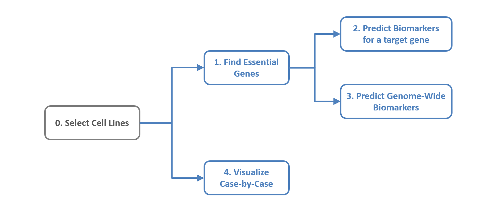
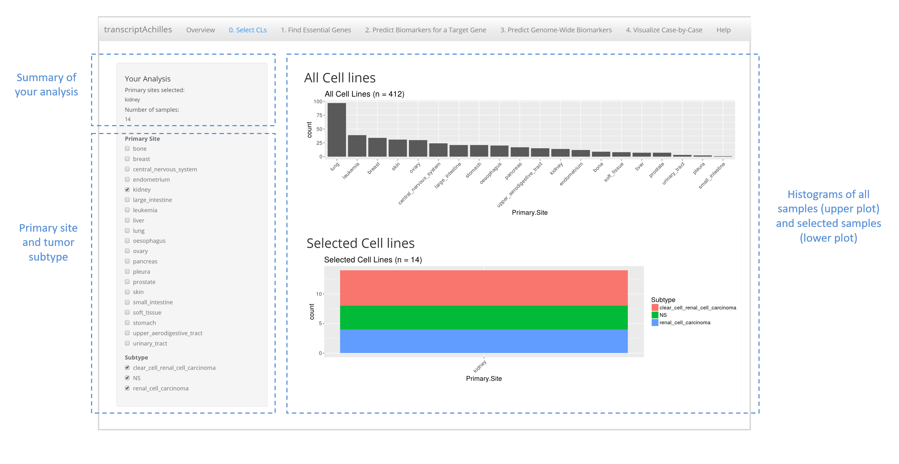

## Help

TranscriptAchilles outputs a ranking of putative drug target genes and their companion biomarkers for a given cohort of cell lines. The functionalities of TranscriptAchilles are presented in a set of panels in the app. Figure 1 shows the TranscriptAchiles' pipeline. 

*Figure 1. TranscriptAchiles' pipeline*

 

The steps of the pipeline are:

**0. Select cell lines.** The user is required to select the cohort of cell lines to be analyzed. Several primary sites and subtypes can be selected at the same time. The application is pre-loaded with all the necessary data, so that the user does not need to upload any data.

**1. Find Essential Genes.**  TranscriptAchilles identifies putative drug targets for the selected cell lines. Essential genes are required to meet several criteria: 1) they must be essential for a minimum percentage of samples in the selected subtype, 2) they must be specific and 3) they must be expressed. These parameters can be tuned within the application.

**2. Predict Biomarkers for a Target Gene.** In this section, the user can select one or more genes of the previous step and predict putative biomarkers for their essentiality. In each case, the application decides whether genes or transcripts are the best markers.

**3. Predict Genome-Wide Biomarkers.** In this case the biomarkers are found for all the essential genes identified in the step Find Essential Genes. 

**4. Visualize Case-by-Case.** The user can also visualize the essentiality of any gene and transcript biomarker. This panel can be run once the cell lines are selected.

### 0. Select cell lines

The user is required to select the cohort of cell lines to be analyzed. Several primary sites and subtypes can be selected at the same time. The application is pre-loaded with all the necessary data, so that the user does not need to upload any data.

*Figure 2. Quick start: selection of samples*

 

### 1. Find essential genes

The second step of the analysis consists in extracting the essential gene list for the selected cell lines. Five tunable parameters allow the user to tailor the output. The toolbox provides a default value for each parameter. The assigned values correspond to our understanding of the minimum conditions which need to be satisfied by a gene to be essential.

The filters correspond to three criteria: essentiality, specificity and expression. Essentiality is a two-legged characteristic.  It refers to the percentage of selected cell lines that have a DEMETER score lower than the essentiality cut-off. Specificity is represented by the enrichment ratio. This filter allows the user to define the minimum ratio between the proportion of selected cell lines for which a gene is essential and the proportion of the rest of the cell lines for which the same gene is essential.

*Figure 3. Quick start: essential genes*

 

### 2. Predict biomarkers for a terget gene

In this section, the user can select one or more genes of the previous step and predict putative biomarkers for their essentiality. In each case, the application decides whether genes or transcripts are the best markers.

*Figure 4. Quick start: prediction of transcript biomarkers*

 

### 3. Predict Genome-Wide Biomarkers. 

In this case the biomarkers are found for all the essential genes identified in the step Find Essential Genes. 

 

### 4. Visualize Case-by-Case. 

The user can also visualize the essentiality of any gene and transcript biomarker. This panel can be run once the cell lines are selected 

 

